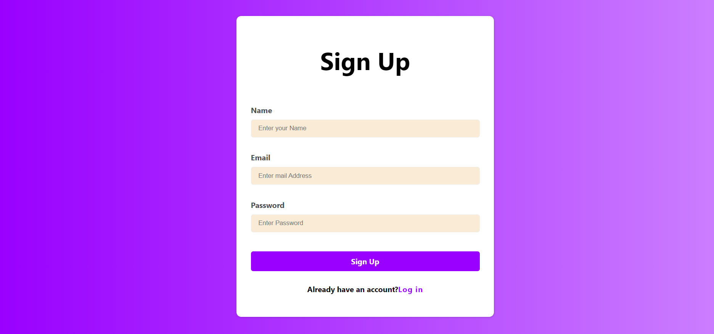

## React-Auth: A Simple Login and Signup Page with React and Firebase

### Description

React-Auth is a straightforward web application that provides user authentication functionality using React and Firebase. It includes user registration, login, and password reset features to help you get started quickly with building secure user authentication systems.

### Features

- User Registration
- User Login
- Password Reset
- Responsive Design
- Firebase Integration
- User-Friendly Interface

### Technology Stack

- React
- Firebase

### Installation

To run the project locally, follow these steps:

1. Clone the repository.
2. Configure Firebase with your project credentials.
3. Install project dependencies with `npm install` or `yarn install`.
4. Start the development server with `npm start` or `yarn start`.

### Usage

- Open the application in your web browser.
- Use the "Signup" and "Login" buttons to access the authentication features.
- Customize the application to suit your project requirements.

### License

This project is licensed under the [MIT License](LICENSE).

